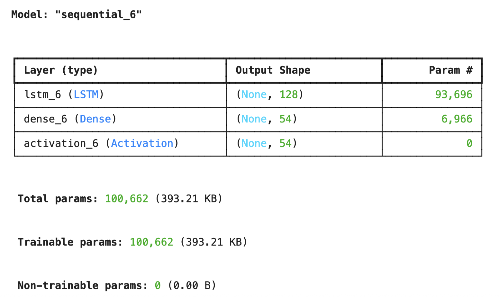
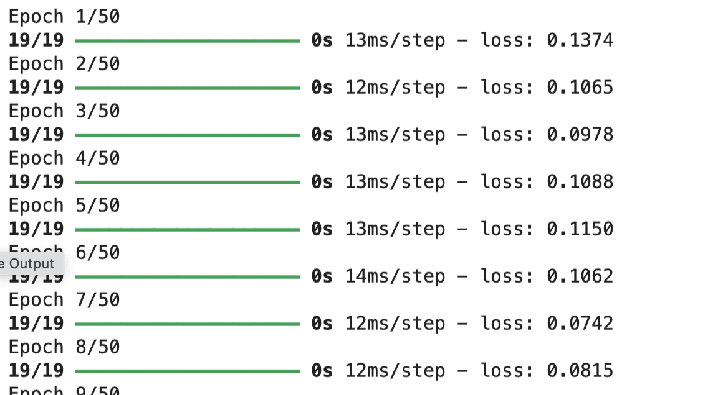
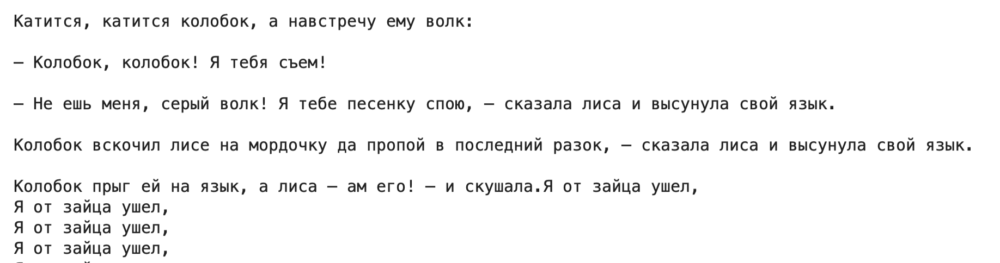

# МИПиС
## mod-lab07-lstm


Срок выполнения задания:

**по 25.05.2025** 

## Lab 07. Генератор текста на основе LSTM - нейронной сети


### Задание

Разработать *пословную* версию программы-генератора текста на основе нейронной сети архитектуры LSTM на основе *посимвольной*

### Краткие сведения из теории

- [Как понять LSTM сети](http://alexsosn.github.io/ml/2015/11/17/LSTM.html)
- [Как устроены рекуррентные нейросети с долгой краткосрочной памятью](https://sysblok.ru/knowhow/mama-myla-lstm-kak-ustroeny-rekurrentnye-nejroseti-s-dolgoj-kratkosrochnoj-pamjatju/)

### Посимвольная реализация

Приведем в качестве примера реализацию генератора, использующую цепочки символов текста.


```Python
import numpy as np
import tensorflow as tf
 
from keras.models import Sequential
from keras.layers import Dense, Activation
from keras.layers import LSTM
 
from keras.optimizers import RMSprop
 
from keras.callbacks import LambdaCallback
from keras.callbacks import ModelCheckpoint
from keras.callbacks import ReduceLROnPlateau
import random
import sys
```

Загружаем текстовый файл для обучения:

```Python
with open('kolobok.txt', 'r') as file:
    text = file.read()
```

Выделяем символы алфавита и нумеруем символы:

```Python
# Получаем алфавит
vocabulary = sorted(list(set(text)))
 
# Создаем словари, содержащие индекс символа и связываем их с символами
char_to_indices = dict((c, i) for i, c in enumerate(vocabulary))
indices_to_char = dict((i, c) for i, c in enumerate(vocabulary))
```

Формируем цепочки символов текста:

```Python
# Разбиваем текст на цепочки длины max_length
# Каждый временной шаг будет загружать очередную цепочку в сеть
max_length = 10
steps = 1
sentences = []
next_chars = []

# Создаем список цепочек и список символов, которые следуют за цепочками
for i in range(0, len(text) - max_length, steps):
    sentences.append(text[i: i + max_length])
    next_chars.append(text[i + max_length])
```

Тренировочный набор для обучения сети:

```Python
# Создаем тренировочный набор
# Создаем битовые вектора для входных значений
# (Номер_цепочки-Номер_символа_в цепочке-Код_символа)
X = np.zeros((len(sentences), max_length, len(vocabulary)), dtype = np.bool)
# Выходные данные
# (Номер_цепочки-Код_символа)
y = np.zeros((len(sentences), len(vocabulary)), dtype = np.bool)
for i, sentence in enumerate(sentences):
    for t, char in enumerate(sentence):
        X[i, t, char_to_indices[char]] = 1
    y[i, char_to_indices[next_chars[i]]] = 1
```

Переходим к построению сети:

```Python
# Строим LSTM-сеть
model = Sequential()
model.add(LSTM(128, input_shape =(max_length, len(vocabulary))))
model.add(Dense(len(vocabulary)))
model.add(Activation('softmax'))
optimizer = RMSprop(learning_rate = 0.01)
model.compile(loss ='categorical_crossentropy', optimizer = optimizer)
```




Далее, разрабатываем функцию ''температуры''.

Функция применяет логарифмическое масштабирование к предсказанным вероятностям. Температура контролирует случайность выхода. Более низкие температуры делают модель более детерминированной, в то время как более высокие значения делают ее более случайной.

```Python
def sample_index(preds, temperature = 1.0):
    preds = np.asarray(preds).astype('float64')
    preds = np.log(preds) / temperature
    exp_preds = np.exp(preds)
    preds = exp_preds / np.sum(exp_preds)
    probas = np.random.multinomial(1, preds, 1)
    return np.argmax(probas)
```

Проводим обучение сети:

```Python
# Обучение LSTM модели
model.fit(X, y, batch_size = 128, epochs = 50)
```



Создаем функцию генерирования текста:

```Python
def generate_text(length, diversity):
    # Случайное начало
    start_index = random.randint(0, len(text) - max_length - 1)
    generated = ''
    sentence = text[start_index: start_index + max_length]
    generated += sentence
    for i in range(length):
            x_pred = np.zeros((1, max_length, len(vocabulary)))
            for t, char in enumerate(sentence):
                x_pred[0, t, char_to_indices[char]] = 1.
 
            preds = model.predict(x_pred, verbose = 0)[0]
            next_index = sample_index(preds, diversity)
            next_char = indices_to_char[next_index]
 
            generated += next_char
            sentence = sentence[1:] + next_char
    return generated
 ```

Генерируем текст:

```Python
print(generate_text(1500, 0.2))
```

Результат генерации:



## Состав проекта

- **src/input.txt** - входной текст для обучения (не менее 10000 слов)
- **src/lstm.py** - текст программы-генератора
- **result/gen.txt** - результирующий текст (не менее 1000 слов)


